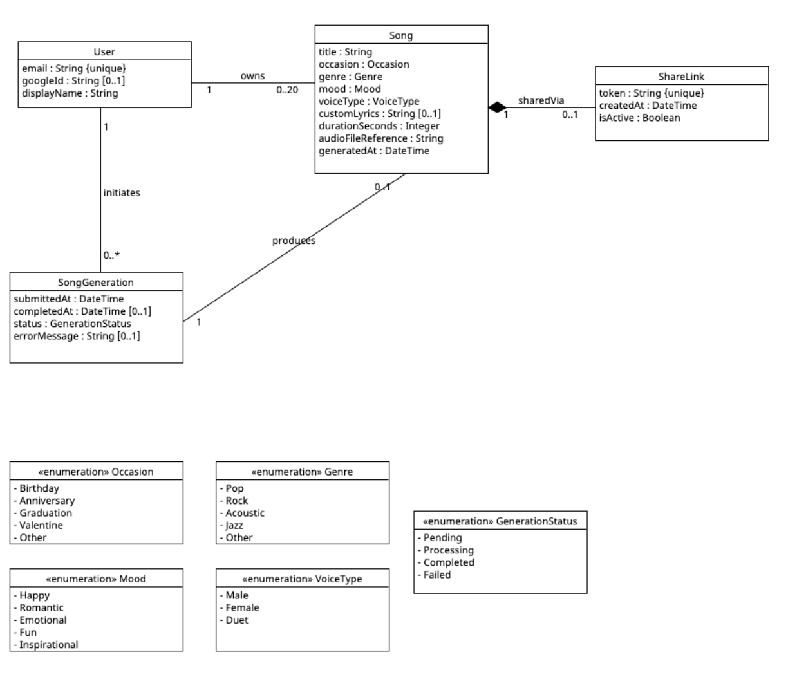

# CIThai – AI-Powered Music Generation Platform

A web-based AI music generation platform that enables users to create personalized songs based on occasion, genre, mood, and custom lyrics.

---

## Tech Stack

**Backend**

- Python 3.13
- Django 5.2
- Django REST Framework
- djangorestframework-simplejwt
- django-allauth (Google OAuth)
- SQLite (development)

**Frontend**

- React 18 + Vite
- React Router DOM

---

## Project Structure

```
CIThai/
├── cithai/                      # Django project configuration
│   ├── settings.py
│   ├── urls.py
│   ├── wsgi.py
│   └── asgi.py
├── music/                       # Main Django application
│   ├── models/                  # One file per domain class
│   │   ├── user.py              # User model
│   │   ├── song.py              # Song model
│   │   ├── song_generation.py   # SongGeneration model
│   │   ├── share_link.py        # ShareLink model
│   │   ├── shared_song_access.py # Tracks shared song access per user
│   │   ├── genre.py             # Genre model
│   │   ├── occasion.py          # Occasion model
│   │   └── enums.py             # GenerationStatus, Mood, VoiceType
│   ├── services/                # Strategy pattern for song generation
│   │   ├── base_strategy.py         # Abstract strategy interface (ABC)
│   │   ├── mock_strategy.py         # Offline mock strategy
│   │   ├── suno_strategy.py         # Suno API strategy
│   │   ├── strategy_selector.py     # Centralized strategy selection
│   │   └── song_creation_service.py # Generation pipeline orchestrator
│   ├── views/
│   │   ├── song_views.py        # SongViewSet, GenerateSongView
│   │   ├── share_views.py       # ShareLinkViewSet, PublicShareView
│   │   ├── auth_views.py        # RegisterView, LoginView
│   │   └── genre_occasion_views.py
│   ├── migrations/
│   ├── serializers.py
│   ├── urls.py
│   └── admin.py
├── frontend/                    # React frontend
│   ├── src/
│   │   ├── pages/               # LoginPage, RegisterPage, LibraryPage, etc.
│   │   ├── components/          # Layout, Toast
│   │   ├── hooks/               # useAuth
│   │   └── api/                 # client.js (API calls)
│   └── vite.config.js
├── manage.py
└── requirements.txt
```

---

## Backend Setup

### 1. Clone the repository

```bash
git clone https://github.com/fcxbsyo/CIThai.git
cd CIThai
```

### 2. Create and activate virtual environment

```bash
python3 -m venv venv

# macOS/Linux:
source venv/bin/activate

# Windows:
venv\Scripts\activate
```

### 3. Install dependencies

```bash
pip install Django==5.2.8 djangorestframework==3.15.2 djangorestframework-simplejwt==5.5.1 django-allauth==0.61.1 cryptography python-dotenv requests
```

### 4. Create a `.env` file in the project root

```
GENERATOR_STRATEGY=mock
SUNO_API_KEY=your_suno_api_key_here
SUNO_CALLBACK_URL=https://webhook.site/your-unique-id
GOOGLE_CLIENT_ID=your_google_client_id_here
GOOGLE_CLIENT_SECRET=your_google_client_secret_here
```

> Never commit `.env` to Git. It is already listed in `.gitignore`.

### 5. Run migrations

```bash
python3 manage.py migrate
```

### 6. Create superuser

```bash
python3 manage.py createsuperuser
```

### 7. Set up genres and occasions in Django admin

Go to `http://127.0.0.1:8000/admin/` and add:

**Genres:** Rock, Pop, Acoustic, Jazz, Other

**Occasions:** Birthday, Anniversary, Graduation, Valentine, Other

### 8. Set up Google OAuth in Django admin

Go to `http://127.0.0.1:8000/admin/sites/site/` and change `example.com` to `localhost:8000`.

Then go to `http://127.0.0.1:8000/admin/socialaccount/socialapp/` → Add:

- Provider: Google
- Name: Google
- Client ID: your Google Client ID
- Secret key: your Google Client Secret
- Sites: move `localhost:8000` to Chosen sites

### 9. Start the backend server

```bash
python3 manage.py runserver
```

---

## Frontend Setup

```bash
cd frontend
npm install
npm run dev
```

Frontend runs at `http://localhost:5173`

---

## Google OAuth Setup (Step-by-Step)

Google OAuth allows users to sign in with their Google account. Follow these steps to obtain credentials:

### Step 1 — Create a Google Cloud Project

1. Go to [https://console.cloud.google.com](https://console.cloud.google.com)
2. Click the project dropdown at the top → **New Project**
3. Name it `CIThai` → click **Create**

### Step 2 — Configure the OAuth Consent Screen

1. In the left menu go to **APIs & Services** → **OAuth consent screen**
2. Select **External** → click **Create**
3. Fill in:
   - App name: `CIThai`
   - User support email: your email
   - Developer contact email: your email
4. Click **Save and Continue**
5. On the Scopes page click **Add or Remove Scopes** and add:
   - `openid`
   - `email`
   - `profile`
6. Click **Save and Continue**
7. On the Test Users page add your own Gmail address
8. Click **Save and Continue** → **Back to Dashboard**

### Step 3 — Create OAuth 2.0 Credentials

1. Go to **APIs & Services** → **Credentials**
2. Click **+ Create Credentials** → **OAuth 2.0 Client ID**
3. Application type: **Web application**
4. Name: `CIThai Web`
5. Under **Authorized JavaScript origins** add:
   ```
   http://127.0.0.1:8000
   http://localhost:8000
   http://localhost:5173
   ```
   > ℹ️ `http://localhost:5173` is the default Vite frontend port. If your frontend runs on a different port (e.g. `5174`), add that instead. You can check your port in the terminal where `npm run dev` is running.
6. Under **Authorized redirect URIs** add both:
   ```
   http://127.0.0.1:8000/accounts/google/login/callback/
   http://localhost:8000/accounts/google/login/callback/
   ```
   > ℹ️ To verify the exact redirect URI your app is sending, run:
   >
   > ```bash
   > curl -v "http://127.0.0.1:8000/accounts/google/login/?process=login" 2>&1 | grep "redirect_uri"
   > ```
   >
   > The value after `redirect_uri=` (URL-decoded) must exactly match one of the URIs above.
7. Click **Create**
8. Copy the **Client ID** and **Client Secret**

### Step 4 — Add to `.env`

```
GOOGLE_CLIENT_ID=your_client_id_here
GOOGLE_CLIENT_SECRET=your_client_secret_here
```

---

## Song Generation (Strategy Pattern)

The system supports two interchangeable generation strategies via the `GENERATOR_STRATEGY` environment variable.

### Mock Mode (default — no API key needed)

```
GENERATOR_STRATEGY=mock
```

```bash
python3 manage.py demo_generation --strategy mock
```

Expected output: `final status : SUCCESS`

### Suno Mode (real AI generation)

```
GENERATOR_STRATEGY=suno
SUNO_API_KEY=your_key_here
SUNO_CALLBACK_URL=https://webhook.site/your-unique-id
```

Get your API key from [https://sunoapi.org](https://sunoapi.org)

Get a free callback URL from [https://webhook.site](https://webhook.site)

```bash
python3 manage.py demo_generation --strategy suno --max-polls 30 --poll-interval 5
```

Expected output: a real `task_id` followed by status polling until `SUCCESS` with an `audio_url`.

### API Key Security

- Never hardcode keys in source code
- `.env` is in `.gitignore` — keep it that way
- Keys are read via `os.environ.get()` in `settings.py`

---

## API Endpoints

| Method      | Endpoint                     | Description                        |
| ----------- | ---------------------------- | ---------------------------------- |
| POST        | `/api/auth/register/`        | Register with email and password   |
| POST        | `/api/auth/login/`           | Login and receive JWT tokens       |
| POST        | `/api/auth/token/refresh/`   | Refresh access token               |
| GET         | `/api/songs/`                | List user's songs                  |
| POST        | `/api/generate/`             | Start song generation (background) |
| GET, DELETE | `/api/songs/{id}/`           | Get or delete a song               |
| GET         | `/api/songs/{id}/download/`  | Download song audio                |
| POST        | `/api/songs/{id}/share/`     | Generate share link                |
| GET         | `/api/songs/shared-with-me/` | Songs shared with current user     |
| GET         | `/api/share/{token}/`        | Public song metadata (no auth)     |
| POST        | `/api/share/{token}/access/` | Record share access after login    |
| GET         | `/api/generations/`          | List generation records            |
| GET         | `/api/genres/`               | List genres                        |
| GET         | `/api/occasions/`            | List occasions                     |

Browse the full API at: `http://127.0.0.1:8000/api/`

---

## Admin

Manage all data at: `http://127.0.0.1:8000/admin/`

Models registered: User, Song, SongGeneration, ShareLink, Genre, Occasion

---

## CRUD Demo Screenshots

[View CRUD screenshots](CRUD)

---

## Domain Model



Core business entities:

- **User** — registered person who owns and shares songs
- **Song** — completed AI-generated creative work
- **SongGeneration** — business record of a generation attempt
- **ShareLink** — controlled sharing permission attached to a song
- **Genre / Occasion** — lookup tables for song parameters
