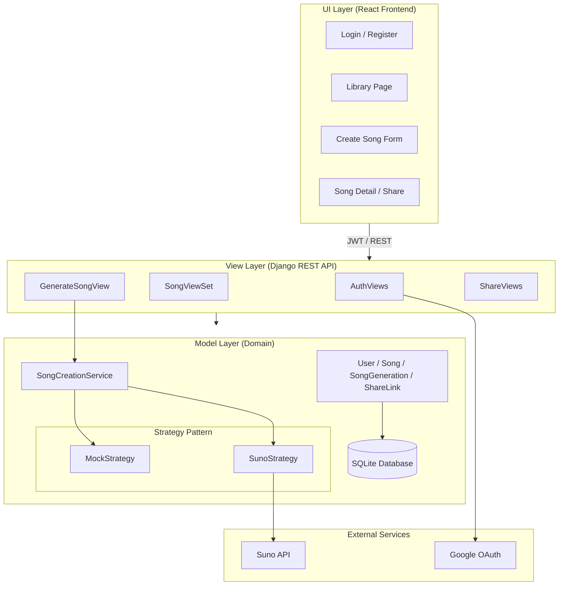

```mermaid
graph TD
    subgraph UI["UI Layer (React Frontend)"]
        A[Login / Register]
        B[Library Page]
        C[Create Song Form]
        D[Song Detail / Share]
    end

    subgraph View["View Layer (Django REST API)"]
        E[AuthViews]
        F[SongViewSet]
        G[GenerateSongView]
        H[ShareViews]
    end

    subgraph Model["Model Layer (Domain)"]
        I[SongCreationService]
        subgraph Strategy["Strategy Pattern"]
            J[MockStrategy]
            K[SunoStrategy]
        end
        L[User / Song / SongGeneration / ShareLink]
        M[(SQLite Database)]
    end

    subgraph External["External Services"]
        N[Suno API]
        O[Google OAuth]
    end

    UI -->|JWT / REST| View
    View --> Model
    E --> O
    G --> I
    I --> J
    I --> K
    K --> N
    L --> M
```
