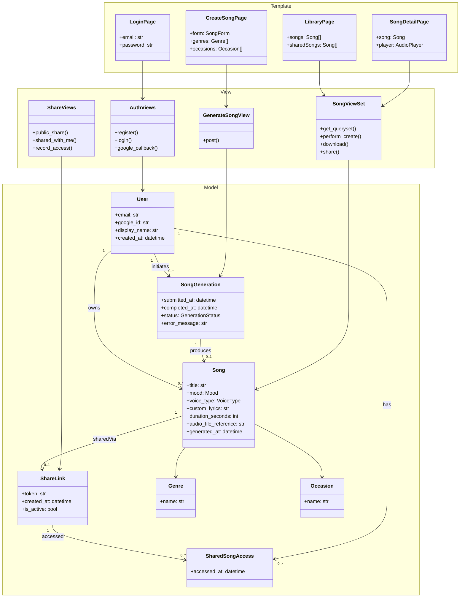

```mermaid
classDiagram
    direction TB

    namespace Model {
        class User {
            +email: str
            +google_id: str
            +display_name: str
            +created_at: datetime
        }
        class Song {
            +title: str
            +mood: Mood
            +voice_type: VoiceType
            +custom_lyrics: str
            +duration_seconds: int
            +audio_file_reference: str
            +generated_at: datetime
        }
        class SongGeneration {
            +submitted_at: datetime
            +completed_at: datetime
            +status: GenerationStatus
            +error_message: str
        }
        class ShareLink {
            +token: str
            +created_at: datetime
            +is_active: bool
        }
        class SharedSongAccess {
            +accessed_at: datetime
        }
        class Genre {
            +name: str
        }
        class Occasion {
            +name: str
        }
    }

    namespace View {
        class SongViewSet {
            +get_queryset()
            +perform_create()
            +download()
            +share()
        }
        class GenerateSongView {
            +post()
        }
        class AuthViews {
            +register()
            +login()
            +google_callback()
        }
        class ShareViews {
            +public_share()
            +shared_with_me()
            +record_access()
        }
    }

    namespace Template {
        class LibraryPage {
            +songs: Song[]
            +sharedSongs: Song[]
        }
        class CreateSongPage {
            +form: SongForm
            +genres: Genre[]
            +occasions: Occasion[]
        }
        class SongDetailPage {
            +song: Song
            +player: AudioPlayer
        }
        class LoginPage {
            +email: str
            +password: str
        }
    }

    User "1" --> "0..*" Song : owns
    User "1" --> "0..*" SongGeneration : initiates
    SongGeneration "1" --> "0..1" Song : produces
    Song "1" --> "0..1" ShareLink : sharedVia
    ShareLink "1" --> "0..*" SharedSongAccess : accessed
    User "1" --> "0..*" SharedSongAccess : has
    Song --> Genre
    Song --> Occasion

    SongViewSet --> Song
    GenerateSongView --> SongGeneration
    ShareViews --> ShareLink
    AuthViews --> User

    LibraryPage --> SongViewSet
    CreateSongPage --> GenerateSongView
    SongDetailPage --> SongViewSet
    LoginPage --> AuthViews
```
