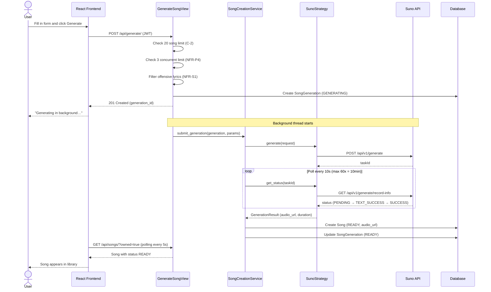

```mermaid
sequenceDiagram
    actor User
    participant UI as React Frontend
    participant View as GenerateSongView
    participant Service as SongCreationService
    participant Strategy as SunoStrategy
    participant Suno as Suno API
    participant DB as Database

    User->>UI: Fill in form and click Generate
    UI->>View: POST /api/generate/ (JWT)
    View->>View: Check 20 song limit (C-2)
    View->>View: Check 3 concurrent limit (NFR-P4)
    View->>View: Filter offensive lyrics (NFR-S1)
    View->>DB: Create SongGeneration (GENERATING)
    View-->>UI: 201 Created (generation_id)
    UI-->>User: "Generating in background…"

    Note over View,Suno: Background thread starts

    View->>Service: submit_generation(generation, params)
    Service->>Strategy: generate(request)
    Strategy->>Suno: POST /api/v1/generate
    Suno-->>Strategy: taskId

    loop Poll every 10s (max 60x = 10min)
        Service->>Strategy: get_status(taskId)
        Strategy->>Suno: GET /api/v1/generate/record-info
        Suno-->>Strategy: status (PENDING → TEXT_SUCCESS → SUCCESS)
    end

    Strategy-->>Service: GenerationResult (audio_url, duration)
    Service->>DB: Create Song (READY, audio_url)
    Service->>DB: Update SongGeneration (READY)

    UI->>View: GET /api/songs/?owned=true (polling every 5s)
    View-->>UI: Song with status READY
    UI-->>User: Song appears in library
```
